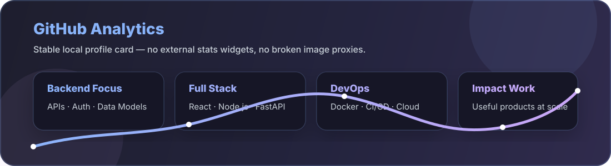

 

<!-- Add your LinkedIn / X (Twitter) badges here once you share the handles, e.g.: -->
<!--  -->

## 👨‍💻 Summary

Full-stack developer and Computer Science undergraduate specializing in AI & Machine Learning, with a growing focus on backend engineering, scalable APIs, and system design. I build reliable web applications that pair thoughtful user experiences with secure, maintainable server-side systems.

My work is especially motivated by practical social impact—from rural-access platforms to campus tools that simplify everyday workflows. I am currently strengthening my knowledge of distributed systems, CI/CD, and machine learning while building production-minded full-stack projects.

## 🎓 Education

**B.Tech, Computer Science Engineering (Artificial Intelligence & Machine Learning)** 
Amity University Madhya Pradesh, Gwalior · Expected June 2028 
**CGPA:** 8.98 / 10

## 🛠️ Technical Skills

**Languages**
 

  
  
  
  
  
  
  

**Frontend**
 

  
  
  
  

**Backend & APIs**
 

  
  
  
  

**Backend Engineering**
 

  
  
  
  
  
  
  
  
  
  
  

**Data & Persistence**
 

  
  
  
  
  
  

**Cloud, DevOps & Collaboration**
 

  
  
  
  
  
  
  

<!-- Icon workflow: add raw SVGs to ./icons, then run `python scripts/resize_icons.py --icons-dir icons --out-dir icons/resized --size 48` to refresh the README-ready assets. -->

**Backend expertise:** Node.js, Express.js, FastAPI, and .NET for building RESTful services; API design, authentication and authorization, JWT/OAuth-based security, RBAC, database modeling, ORM-driven data access, caching with Redis, rate limiting, logging, monitoring, and asynchronous service patterns. Familiar with GraphQL, WebSockets, message queues, API documentation using OpenAPI/Swagger, automated testing, containerized deployments with Docker and Kubernetes, and CI/CD workflows.

  
  
  
  
  
  
  
  
  
  
  
  
  
  
  
  
  
  

## 📊 GitHub Analytics

## 🐍 Contribution Snake

## 💼 Experience & Selected Projects

I apply full-stack and backend development practices across academic, independent, and social-impact projects. The work below emphasizes API-driven architecture, data management, deployment, and measurable outcomes.

<table>
<tr>
<td width="50%" valign="top">

### 🔐 [CyberForge](https://github.com/neonninja-9)
Built an interactive cryptography learning platform covering **18+ algorithms** (AES, RSA, and ECC), with a FastAPI-powered backend, containerized workflow, and Vercel deployment.

`React.js` `Vite` `FastAPI` `Python` `Docker` `Supabase`

</td>
<td width="50%" valign="top">

### 💡 IdeaForge
Developed a full-stack idea-sharing platform with secure profile and submission management, improving query response time by **40%** through more efficient data access.

`Angular` `.NET` `PHP` `Oracle` `MySQL`

</td>
</tr>
<tr>
<td width="50%" valign="top">

### 🌱 CarbonX — Carbon Footprint System
Created a dual-dashboard carbon-credit marketplace with API-driven workflows, facilitating **₹42 Cr** in transactions and tracking **18,000+ tons of CO₂** offset across 890+ projects.

`React` `Node.js` `REST APIs` `Recharts`

</td>
<td width="50%" valign="top">

### 🎓 amisos — Smart Out Pass System
Built a smart campus gate-pass system for Amity University that reduced manual processing time by **60%** for 5,000+ students.

`Kotlin` `Ruby` `MongoDB`

</td>
</tr>
</table>

*Also building UBA social-impact prototypes — voice-first rural marketplaces & grievance-access platforms.*

## 🤝 Let's Connect

<!-- LinkedIn / X placeholders — swap in your handle when ready:

-->

